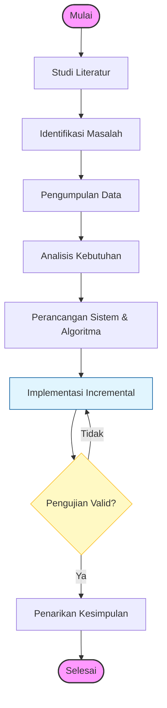

# BAB 3
# METODOLOGI PENELITIAN

## 3.1 Tahapan Penelitian

Tahapan penelitian ini disusun secara sistematis untuk memastikan tujuan penelitian tercapai dengan baik. Alur penelitian mengikuti kerangka kerja pengembangan perangkat lunak (SDLC) model Incremental yang dikombinasikan dengan tahapan eksperimen algoritma. 

Alur tahapan penelitian digambarkan dalam diagram alir (*flowchart*) berikut:

**Keterangan Tahapan:**

1.  **Studi Literatur:** Mempelajari teori dan penelitian terdahulu terkait *University Course Timetabling Problem* (UCTP) serta metodologi pengembangan sistem.
2.  **Identifikasi Masalah:** Mengidentifikasi permasalahan spesifik pada proses penjadwalan di lapangan melalui observasi dan wawancara, serta merumuskan tantangan yang harus diselesaikan.
3.  **Pengumpulan Data:** Mengumpulkan data operasional dari SIAKAD, sistem peminjaman ruang, dan aturan akademik sebagai bahan dasar dataset penjadwalan.
4.  **Analisis Kebutuhan:** Menganalisis kebutuhan fungsional dan non-fungsional sistem serta mengidentifikasi *hard constraints* dan *soft constraints*.
5.  **Perancangan Sistem & Algoritma:** Merancang arsitektur sistem, basis data, antarmuka pengguna, serta desain detail algoritma hibrida SA-TS.
6.  **Implementasi (Incremental):** Membangun sistem secara bertahap (per increment) mulai dari *backend*, algoritma, hingga *frontend*.
7.  **Pengujian:** Melakukan pengujian fungsionalitas sistem dan pengujian performa algoritma untuk memvalidasi kualitas jadwal. Jika hasil belum valid atau optimal, proses kembali ke tahap implementasi/perbaikan.
8.  **Penarikan Kesimpulan:** Menganalisis hasil pengujian dan menarik kesimpulan.

## 3.2 Studi Literatur dan Pengumpulan Data

Tahap ini dilakukan dengan dua pendekatan utama untuk membangun landasan teori yang kuat serta mendapatkan data operasional yang valid:

1.  **Kajian Pustaka (Literature Review):** Mempelajari buku, jurnal, dan prosiding terkait algoritma *Simulated Annealing*, *Tabu Search*, dan *Greedy Algorithm*. Fokus kajian mencakup representasi solusi, formulasi fungsi *fitness*, dan mekanisme hibridasi yang efektif.
2.  **Pengumpulan Data Operasional:** Mengumpulkan data riil yang dibutuhkan untuk proses penjadwalan dari sumber resmi di Universitas Internasional Semen Indonesia (UISI), antara lain:
    *   **Sistem Informasi Akademik (SIAKAD):** Mengambil data master Dosen, daftar Mata Kuliah yang dibuka, pembagian Kelas, dan beban SKS.
    *   **Sistem Peminjaman Ruang:** Mendapatkan data inventaris Ruangan, kapasitas kursi, dan jenis ruangan (Lab/Teori).
    *   **Bagian Administrasi Akademik:** Melakukan studi dokumen terhadap Panduan Akademik, Kalender Akademik, serta aturan *plotting* jadwal yang berlaku.

## 3.3 Identifikasi Masalah

Tahap ini bertujuan untuk memetakan permasalahan spesifik di lapangan. Identifikasi masalah dilakukan melalui:

1.  **Observasi:** Mengamati langsung proses penyusunan jadwal manual yang sedang berjalan untuk memahami kompleksitas dan potensi *human error*.
2.  **Wawancara:** Melakukan tanya jawab dengan staf Administrasi Akademik guna memvalidasi kendala (*constraints*) unik, seperti aturan waktu sholat, preferensi dosen, dan kebijakan kelas pagi/sore.

Berdasarkan hasil observasi dan wawancara, masalah utama yang diidentifikasi adalah:
1.  Waktu penyusunan jadwal manual yang lama.
2.  Kesulitan mengakomodasi *constraints* yang kompleks (konflik dosen, ruang, dan waktu ibadah) secara manual.
3.  Belum adanya alat bantu otomatis yang dapat memberikan rekomendasi jadwal optimal.

## 3.4 Analisis Kebutuhan

Analisis kebutuhan dilakukan untuk mendefinisikan spesifikasi sistem yang akan dibangun agar sesuai dengan harapan pengguna.

### 3.4.1 Analisis Kebutuhan Fungsional

Kebutuhan fungsional mendefinisikan layanan-layanan yang harus disediakan oleh sistem, sebagaimana dirinci pada Tabel 3.1 berikut:

**Tabel 3.1 Daftar Kebutuhan Fungsional**

| Kode | Deskripsi Kebutuhan Fungsional |
|------|-------------------------------|
| KF-01 | Sistem harus dapat mengelola (CRUD) data master akademik (Dosen, Mata Kuliah, Ruangan, dan Slot Waktu). |
| KF-02 | Sistem harus memungkinkan konfigurasi parameter algoritma secara comprehensive. |
| KF-03 | Sistem mampu menjalankan proses pembuatan jadwal otomatis menggunakan algoritma hibrida SA-TS. |
| KF-04 | Sistem harus dapat menampilkan visualisasi jadwal hasil optimasi dalam format tabel/matriks yang interaktif. |
| KF-05 | Sistem mampu mendeteksi dan menandai konflik (bentrok) pada jadwal secara visual dan informatif. |
|KF-06 | Sistem harus menyediakan fitur edit manual pada jadwal yang dihasilkan. |
| KF-07 | Sistem menyediakan fitur ekspor hasil penjadwalan ke dalam format dokumen eksternal (Excel/CSV/PDF). |

### 3.4.2 Analisis Kebutuhan Non Fungsional

Kebutuhan non-fungsional mendefinisikan batasan kualitas sistem:
1.  **Performance:** Algoritma harus mampu menghasilkan solusi jadwal yang *feasible* (tanpa pelanggaran *hard constraint*) dalam waktu komputasi yang wajar (misalnya < 15 menit untuk satu semester).
2.  **Usability:** Antarmuka pengguna (Web UI) harus intuitif dan responsif.
3.  **Reliability:** Sistem mampu menangani kegagalan proses tanpa merusak integritas data.
4.  **Scalability:** Arsitektur sistem mendukung penambahan data jumlah kelas atau dosen di masa depan tanpa perubahan kode yang signifikan.

## 3.5 Perancangan Sistem

Perancangan sistem bertujuan untuk memberikan gambaran teknis mengenai bagaimana sistem akan dibangun.

### 3.5.1 Use Case Diagram

Perancangan interaksi pengguna dengan sistem digambarkan melalui Use Case Diagram yang mencakup aktor **Admin Akademik**. Use case utama meliputi:
*   **Login:** Autentikasi pengguna untuk masuk ke sistem.
*   **Kelola Data Master:** Mengelola data dosen, ruangan, mata kuliah, dan waktu.
*   **Konfigurasi Parameter:** Mengatur parameter algoritma (Suhu awal, Iterasi, Bobot Penalti).
*   **Generate Jadwal:** Menjalankan proses optimasi jadwal.
*   **Lihat & Edit Jadwal:** Melihat hasil jadwal dan melakukan perubahan manual jika diperlukan.
*   **Ekspor Laporan:** Mengunduh jadwal dalam format dokumen.

### 3.5.2 Rencana Increment

Sesuai dengan metode SDLC Incremental, pengembangan dibagi menjadi beberapa iterasi (increment) fungsional:

*   **Increment 1: Core Engine & Basic Data.**
    *   Fokus: Implementasi struktur data dasar, algoritma *Greedy* untuk solusi awal, dan validasi *hard constraint* dasar.
    *   Output: Sistem CLI yang bisa menghasilkan jadwal kasar tanpa konflik fatal.
*   **Increment 2: Optimization Algorithm (SA-TS).**
    *   Fokus: Implementasi *Simulated Annealing*, integrasi *Tabu List*, dan fungsi objektif *soft constraints*.
    *   Output: *Engine* optimasi yang mampu meningkatkan kualitas jadwal secara iteratif.
*   **Increment 3: Web API & Database Integration.**
    *   Fokus: Membungkus *engine* dalam REST API, persistensi data ke database.
    *   Output: Backend server yang siap menerima *request*.
*   **Increment 4: User Interface & Visualization.**
    *   Fokus: Pengembangan antarmuka React untuk input data dan melihat hasil jadwal (Tabel/Matriks).
    *   Output: Aplikasi web utuh yang *user-friendly*.

### 3.5.3 Desain Antarmuka

Desain antarmuka dirancang untuk kemudahan penggunaan (*User Experience*).
1.  **Dashboard:** Menampilkan ringkasan statistik (Total Dosen, Kelas, Ruang) dan status server.
2.  **Timetable View:** Tampilan jadwal dalam format kalender mingguan *grid* yang interaktif. Pengguna dapat memfilter berdasarkan Ruangan, Dosen, atau Tingkat Semester.
3.  **Conflict Monitor:** Panel notifikasi yang menunjukkan detail pelanggaran *constraint* (jika ada) dan memberikan saran perbaikan.

### 3.5.4 Desain Arsitektur Sistem

Arsitektur sistem menggunakan pola *Client-Server* dengan komunikasi melalui REST API.
1.  **Frontend (Client):** Dibangun menggunakan **React** (TypeScript) sebagai antarmuka pengguna.
2.  **Backend (Server):** Dibangun menggunakan **Node.js/Bun** (TypeScript) yang menangani logika bisnis.
3.  **Optimization Engine:** Modul khusus di sisi backend yang menjalankan algoritma Hibrida *Simulated Annealing* dan *Tabu Search*. Representasi solusi dikodekan sebagai himpunan *assignment* (Kelas, Waktu, Ruangan), dengan fungsi fitness meminimalkan penalti pelanggaran *constraints*.

## 3.6 Pengujian

Pengujian dilakukan untuk memverifikasi bahwa sistem memenuhi spesifikasi yang telah ditetapkan.

1.  **Pengujian Algoritma (White Box):** Mengukur performa algoritma dalam mencapai solusi optimal. Metrik yang digunakan adalah *Fitness Value* (harus mendekati 0), jumlah pelanggaran *hard constraint* (wajib 0), dan waktu eksekusi.
2.  **Pengujian Sistem (Black Box):** Menguji fungsionalitas fitur-fitur pada aplikasi web (Input, Proses, Output) untuk memastikan sistem berjalan sesuai skenario *Use Case* dan bebas dari *error*.